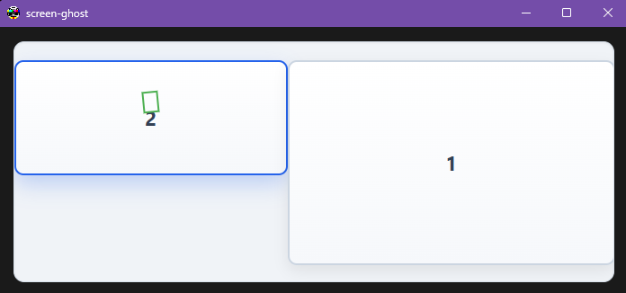

## Screen Ghost

> 实时人脸检测与马赛克遮罩的桌面人眼保护工具
> 基于 Tauri + React + Rust，集成 Python/OpenCV/InsightFace，支持多显示器与高帧低延迟渲染

---

### 需求场景

- 观看任何视频或图片时，自动对“目标人物”打码
- 覆盖本地播放器、浏览器、图像查看器等全场景

---

### 核心特性

- **高帧低延迟**：
- **两种工作模式**：
  - 无目标库：检测“全部人脸”并打码
  - 有目标库：按同一 `image_scale` 在整图上执行 InsightFace 检测+识别，仅对命中的“目标人物”返回框
- **自动化 Python 环境**：
  - 首次启动自动创建 venv、静默安装依赖（numpy/opencv/onnxruntime/insightface）
- **安全性**：
  - 开源可审计，无网络连接，无后门，无毒无害

---

### 运行截图/示例

- 覆盖层（Overlay）在独立窗口渲染马赛克，不改动原桌面画面
- 可自定义 `mosaic_style`（CSS 字符串）实现不同样式的遮罩




---

### 安装与运行

#### 方式一：直接下载运行（推荐）

1. 前往[Releases页面](https://github.com/alvinfunborn/screen-ghost/releases)下载发布包，解压到任意目录
2. 确保目录结构如下：
   ```
   your-directory/
   ├── screen-ghost.exe
   ├── config.toml
   ├── python/
       ├── faces.py
   └── faces/
       ├── 张三/
       │   ├── photo1.jpg
       │   └── photo2.jpg
       └── 李四/
           ├── photo1.jpg
           └── photo2.jpg
   ```
3. 在 `faces/` 目录下创建子文件夹（如人名），放入目标人脸照片
4. 双击 `screen-ghost.exe` 运行

首启会自动：
- 检测系统 Python；若不可用则创建 venv 并安装依赖
- 后续启动会先验证 venv 依赖是否齐全，齐全则跳过安装

> 环境：Windows 10/11 x64；可用 GPU 则优先 CUDA，其次 DirectML，否则 CPU。
>
> **可选的 GPU 加速**：如果你想要 CUDA 加速以获得更好的性能，需要安装 NVIDIA CUDA 12.x 和 NVIDIA cuDNN 9。当前的 onnxruntime-gpu 版本（>=1.16）与 Windows 下的 CUDA 12.x + cuDNN 9 兼容。
>
> ⚠️ **注意**：CUDA 13.x 与当前的 onnxruntime-gpu 版本不兼容。

#### 方式二：源码编译运行

```bash
# 克隆仓库
git clone https://github.com/alvinfunborn/screen-ghost.git
cd screen-ghost

# 安装前端依赖
npm ci

# 构建 Tauri 后端
cd src-tauri
cargo build

# 开发模式启动
cd ..
npm run tauri dev
```

---

### CUDA/cuDNN 配置（Windows）

**可选步骤**（仅当你想要 CUDA 加速时）：

1. **安装 NVIDIA CUDA 12.x**（不支持 CUDA 13.x）- 这提供了所需的运行库
2. 更新至最新的 NVIDIA GameReady/Studio 驱动。
3. 安装 NVIDIA cuDNN 9（Windows x64）。安装后确保应用能找到 `cudnn64_9.dll`，可选其一：
   - 将 cuDNN 的 `bin` 目录加入系统 `PATH`
   - 或将该 DLL 复制到 venv 的 ONNX Runtime 目录：
     - `%APPDATA%\screen-ghost\python_env\Lib\site-packages\onnxruntime\capi\cudnn64_9.dll`
3. 重启应用。日志应显示 `Applied providers: ['CUDAExecutionProvider', 'CPUExecutionProvider']`。

---

### 配置说明（`src-tauri/config.toml`）

```toml
[face.detection]
min_face_ratio = 0.05      # 最小人脸检测比例（短边百分比），未提供时回退到 *_face_size
max_face_ratio = 0.9
scale_factor = 1.2         # Haar 上采样步进
min_neighbors = 3
confidence_threshold = 0.4 # 低于该置信度可丢弃
use_gray = true
image_scale = 0.7          # 检测时整图缩放

[face.recognition]
# auto | cpu | cuda | dml
provider = "auto"          # 识别模型运行环境, auto 会按 CUDA→DML→CPU 选择并安装对应 ORT 变体
threshold = 0.55           # 识别命中阈值（余弦相似度）
outlier_threshold = 0.3    # 离群点剔除阈值（构建每人均值特征）
outlier_iter = 2

[monitoring]
interval = 8               # 主循环间隔(ms)
mosaic_scale = 2.0         # 马赛克矩形几何放大倍率（与 DPI 无关）
capture_scale = 1.0        # 截图后、检测前的下采样比例（提速）
mosaic_style = """
{
    position: absolute;
    background-color: rgba(0,0,0,0.4);   /* 示例：半透明黑遮罩 */
    image-rendering: pixelated;
    border-radius: 4px;
}
"""

[system]
log_level = "debug"
```

---

### 目标人脸照片库（`faces/<姓名>/xxx.jpg`）

- **张数**：推荐每人 5–10 张（≥3 可用，>20 通常收益递减）
- **质量**：边长 ≥ 160–200px，清晰、无遮挡；光照多样但不过曝/过暗
- **多样性**：轻微姿态/表情/光照变化；少量戴眼镜可保留；避免高度重复
- **组织**：一人一文件夹，不要混入他人照片；方向异常请先修正

应用启动时会预加载该目录，计算每人的“均值特征”，并按阈值/迭代剔除离群样本。

### 环境初始化与落盘位置

- 安装/写入位置（Windows）
  - Python 虚拟环境：`%APPDATA%/screen-ghost/python_env/`
  - Python 脚本提取目录：`%APPDATA%/screen-ghost/python_files/`
  - 应用配置（示例）：`config.toml`（与 exe 同级）
  - 目标人脸库：`faces/`（与 exe 同级）
- 每次启动的初始化行为
  - 优先从 exe 同级目录的 `python/` 复制脚本到 `python_files/`
  - Python 依赖（numpy/opencv/onnxruntime/insightface）会在隔离的 venv 中安装；`provider=auto` 会自动选择 CUDA→DML→CPU 的最佳 ORT 变体。

---

### 常见问题与解决方案

#### CUDA 版本兼容性问题

**问题**：许多用户尝试使用 CUDA 13.x 时遇到错误。

**根本原因**：当前的 onnxruntime-gpu 版本（>=1.16）专门为 NVIDIA CUDA 12.x 和 NVIDIA cuDNN 9 构建。CUDA 13.x 引入了不兼容的破坏性更改。

**解决方案**：
1. 从 NVIDIA 官网安装 NVIDIA CUDA 12.x（不是 13.x）
2. 安装 Windows x64 的 NVIDIA cuDNN 9
3. 确保你的 NVIDIA 驱动是最新的

**验证**：安装后，应用应自动检测 CUDA 12.x 运行库并在可用提供者中显示 `CUDAExecutionProvider`。

#### 缺少 cuDNN 9 错误

**问题**：应用显示缺少 CUDA/cuDNN 的警告并回退到 DirectML。

**解决方案**：
1. 从 NVIDIA 开发者网站下载 Windows x64 的 NVIDIA cuDNN 9
2. 解压并将 `bin` 目录添加到系统 PATH，或者
3. 将 `cudnn64_9.dll` 复制到应用的 ONNX Runtime 目录

**注意**：正确安装 cuDNN 9 后，应用会自动切换回 CUDA。

